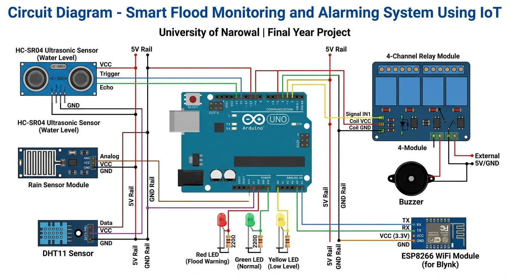
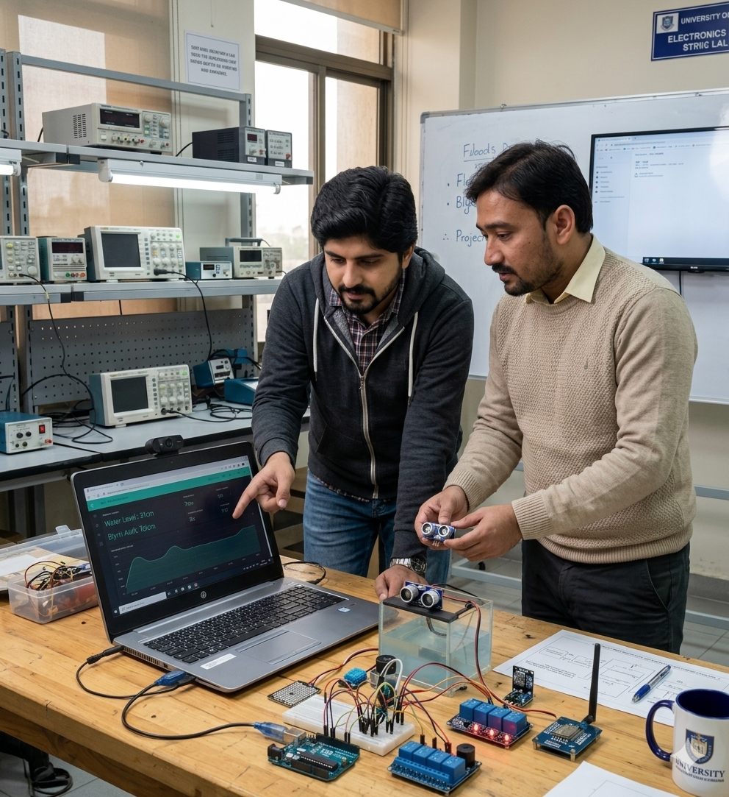

# Smart Flood Monitoring and Alarming System Using IoT

**Final Year Project**  
**BS Computer Science (Session 2020-2024)**  
**University of Narowal, Pakistan**

**Submitted by:**  
- M Hur Abbas (20-UON-1321)
- Muhammad Faizan (20-UON-1328)  

**Supervised by:** Mr. Zishan Zafar

---

## 📋 Project Overview
A real-time IoT-based flood monitoring and early warning system using Arduino, sensors, and Blynk mobile app. It measures water level, rainfall, temperature & humidity and sends instant alerts.

## 🎥 Demo Video

## 📄 Full Documentation
**[Download Complete Project Report (PDF)](FLOOD-MONITORING-SYSTEM-DOCUMENTATION.pdf)**

---

## 👥 Team Members

<table>
  <tr>
    <th align="center">M Hur Abbas</th>
    <th align="center">Muhammad Faizan</th>
  </tr>
  <tr>
    <td align="center">
      
    </td>
    <td align="center">
      
    </td>
  </tr>
</table>

# 🖼️ Project Gallery

## Blynk Mobile App Dashboard 

## Circuit Diagram  

## Hardware Setup  

## Team Working on Project  

---

## 🛠️ Key Features
- Real-time water level monitoring (Ultrasonic Sensor)
- Rainfall detection
- Temperature & Humidity monitoring (DHT11)
- Automatic LED indicators + Buzzer
- Blynk IoT mobile dashboard
- Early flood alerting system

## 🧪 Hardware Used
- Arduino Uno
- HC-SR04 Ultrasonic Sensor
- Rain Sensor
- DHT11 Temperature/Humidity Sensor
- 4-Channel Relay Module
- ESP8266 WiFi Module

## 📝 Project Summary
This project develops a real-time IoT-based flood early warning system to help reduce disaster risks in flood-prone areas. The system uses an ultrasonic water-level sensor (HC-SR04), rain sensor, and DHT11 temperature/humidity sensor connected to an Arduino Uno and ESP8266. Sensor data is continuously collected, processed through smart threshold logic, and instantly transmitted to the Blynk IoT platform, which sends mobile alerts and displays live readings on a web dashboard.
Working as a group with one fellow student, I personally handled the full hardware design and assembly, wrote the complete Arduino C++ code, implemented cloud connectivity and mobile notifications, built the live monitoring dashboard, performed system testing and calibration, and prepared all technical documentation. I also created and maintain this GitHub repository.
The final prototype successfully demonstrates how IoT, sensor networks, and real-time data processing can provide timely flood alerts and support community safety.
  

---

**Made with ❤️ at University of Narowal**  
**Date:** July 2024
