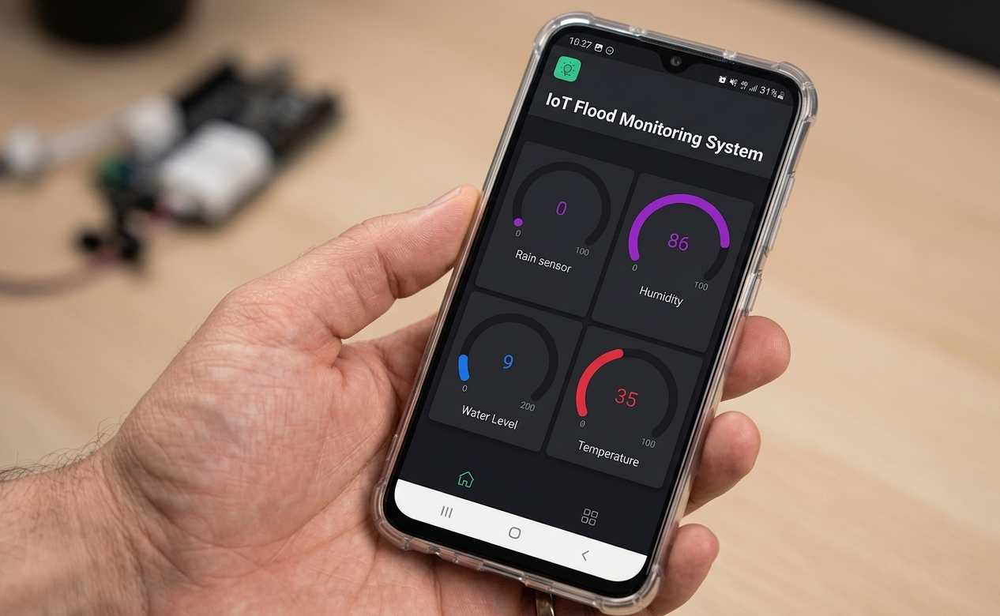
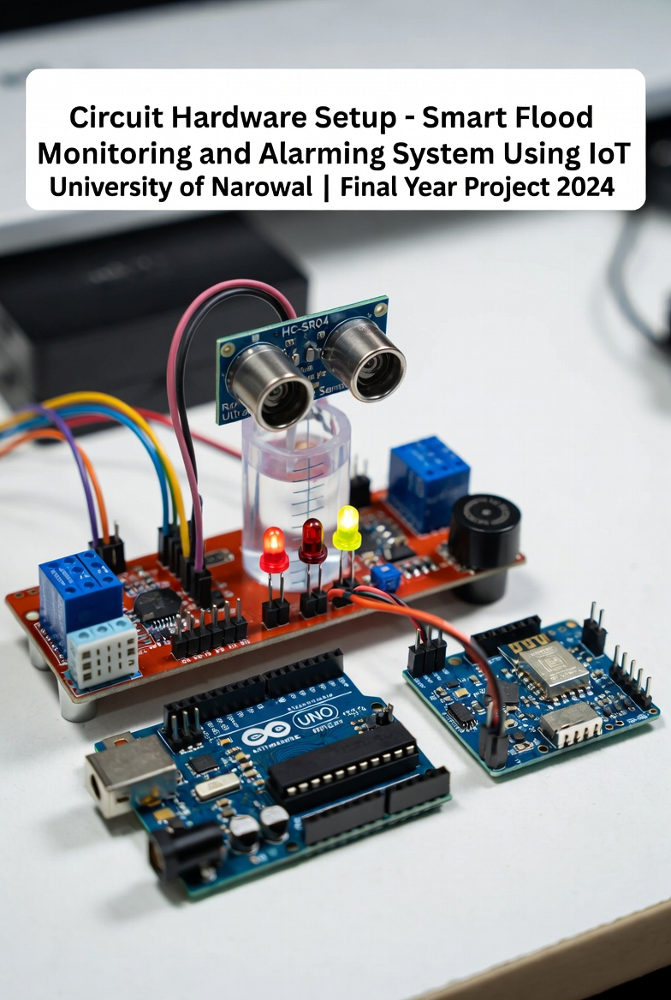

# Smart Flood Monitoring and Alarming System Using IoT

**Final Year Project**  
**BS Computer Science (Session 2020-2024)**  
**University of Narowal, Pakistan**

**Submitted by:**  
- Muhammad Faizan (20-UON-1328)  
- M Hur Abbas (20-UON-1321)

**Supervised by:** Mr. Zishan Zafar

---

## 📋 Project Overview
A real-time IoT-based flood monitoring and early warning system using Arduino, sensors, and Blynk mobile app. It measures water level, rainfall, temperature & humidity and sends instant alerts.

## 🎥 Demo Video

## 📄 Full Documentation
**[Download Complete Project Report (PDF)](FLOOD-MONITORING-SYSTEM-DOCUMENTATION.pdf)**

## 👥 Team Members

| Muhammad Faizan                  | M Hur Abbas                     |
|----------------------------------|---------------------------------|
|  |  |

---

## 🖼️ Project Gallery

**Blynk Mobile App Dashboard**  

**Circuit Diagram**  

**Hardware Setup**  

**Team Working on Project**  

---

## 🛠️ Key Features
- Real-time water level monitoring (Ultrasonic Sensor)
- Rainfall detection
- Temperature & Humidity monitoring (DHT11)
- Automatic LED indicators + Buzzer
- Blynk IoT mobile dashboard
- Early flood alerting system

## 🧪 Hardware Used
- Arduino Uno
- HC-SR04 Ultrasonic Sensor
- Rain Sensor
- DHT11 Temperature/Humidity Sensor
- 4-Channel Relay Module
- ESP8266 WiFi Module

---

**Made with ❤️ at University of Narowal**  
**Date:** July 2024
